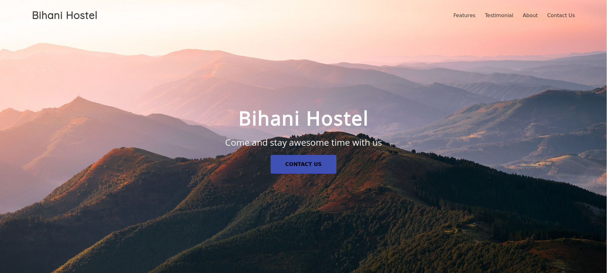
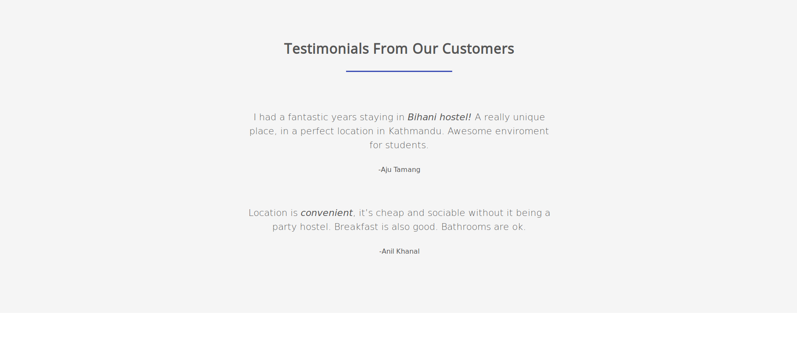

# Bihani Hostel

## SETUP
### For WINDOWS
- [x] Create a virtualenv in windows, make sure you install python 3.x version

       * `virtualenv Bihani`
   
- [x] Activate virtualenv
       
       * `cd Bihani`
       
       * `cd scripts`
       
       * `activate.bat`
       
       * `cd ..`
- [x] Clone the project  
   
- [x] Install Python packages

       * `pip install -r requirements.txt`         

### FOR LINUX
- coming soon

## Screenshots

#### Homepage

#### Features

#### Testimonials

#### Footer

# Author
- Aju Tamang

# Technologies
### Frontend 
- HTML5
- CSS3

### Backend

Python & Django
SQLITE (Database)

## Get Feedback

- This repository: Submit a PR with your README!

## Contribute

Contributions are always welcome!
Please read the [contribution guidelines] (contributing.md) first

## License

To the extent possible under law, [Matias Singers](https://mts.io) has waived all copyright and related or neighboring rights to this work.