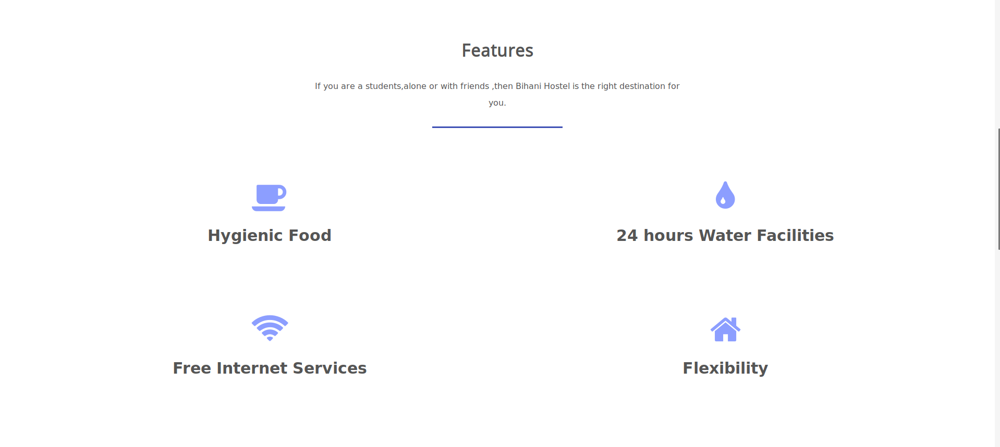

# Bihani Hostel

## SETUP
### For WINDOWS
   -[x] Create a virtualenv in windows, make sure you install python 3.x version
       * virtualenv Bihani
    -[x] Activate virtualenv
       * cd Bihani
       * cd scripts
       * activate.bat
       * cd ..
    -[x] Clone the project  
    -[x] Install Python packages
       * pip install -r requirements.txt         

### FOR LINUX
- comming soon

## Screenshots

#### Homepage

#### Features

#### Testimonials

#### Footer

# Author
- Aju Tamang

# Technologies
### Frontend 
- HTML5
- CSS3

### Backend
- Python & Django
- SQLITE (Database)